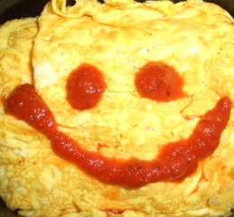
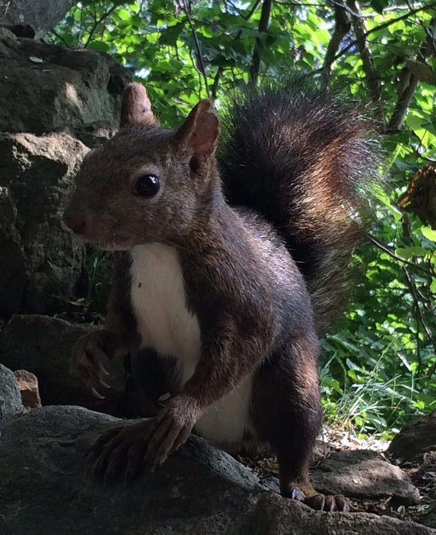

# 自己紹介

author
:   irasally

# こんにちは! オム子です

{:relative_height='100'}

# オム子の特徴

* 札幌在住
* プログラマ
* Ruby, Java, C#
* Emacs{::note}（を使いこなしたい）{:/note}派
* 食, 酒, 写真, *山登り*
* 新婚{::note}（と呼べるのは2015.11まで）{:/note}

# 山はよいものです

{:relative_height='100'}

{::note}https://www.flickr.com/photos/irasally/21591737686/{:/note}

# 山のよさ

* やすらぎ
  * 緑と動物（リス, クマ）
  * 疲れた目に優しい
* 苦労のあとのごほうび
  * 苦労は報われる
* ごはんが美味しい
   * 空気がうまい

# 頂上で食べるおにぎり

さいこう（ギョニソーも良い）

{:relative_height='100'}

{::note}http://miil.me/g/6gwf0{:/note}

# 簡単にはじめられます

* だいたい家にある
  * 運動靴
  * タオル
  * 帽子
  * 虫除け
    * 北見ハッカ油奨励
  * 日焼け止め
  * 元気な体

# お金がかかりません

* 往復交通費・頂上のご飯代で楽しめる
* メンテナンスは自分の体
  * 片付けも楽
  * 洗濯、靴の泥洗い
* 比較：自転車, 写真
  * *初期コストの低さ* はダントツ

# もし好きになりそうだったら

道具を買い足していく楽しみ

* まずは「靴」「靴下」
* 安全の「クマ鈴」
* 機能性の高い衣類
  * 速乾性
  * 保温性

# 沼はどこにでもある

いろんな山に登ると欲しい道具は増える

* 登山用リュック
* ハイドレーションシステム
* 手袋
* 頂上でコーヒー飲みたい

# 自然を分けてもらっている

* ゴミは持ち帰る
* 植物は持ち帰らない
* 野生動物に人間の食べ物をあげない
* 悪天候, 体調不良で無理はしない
* 危険な道に行かない
* 自分のペースで!

# 札幌近郊おすすめ

* 円山
* 八剣山
* 塩谷丸山
* 藻岩山
* 三角山
* 空沼

# 行ってみよう

* 最初は登り慣れた人と行こう
* なるべく複数人で行こう
* 天気予報は良く見よう
* クマ情報にも注目しよう
* これから紅葉が見頃のようです

# 山、たのしいよ

{:relative_height='100'}

{::note}https://www.flickr.com/photos/irasally/21591737686/{:/note}
